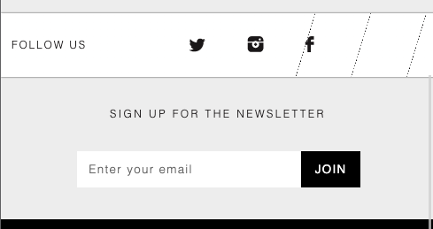
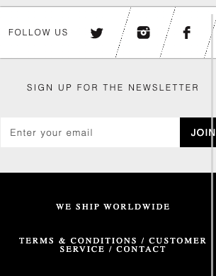
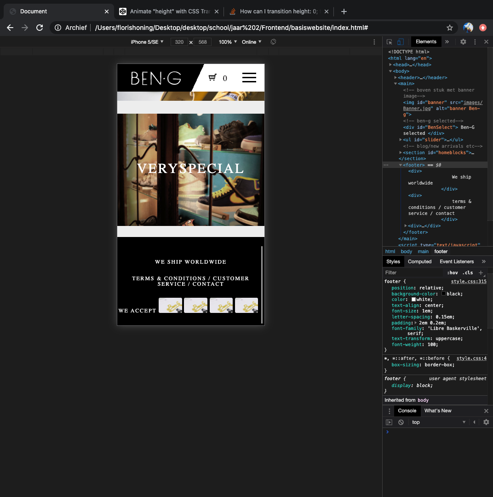
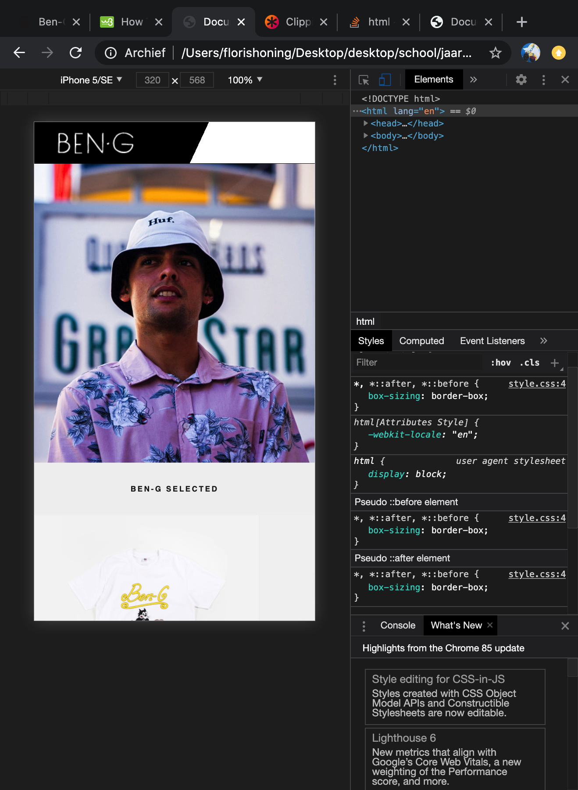
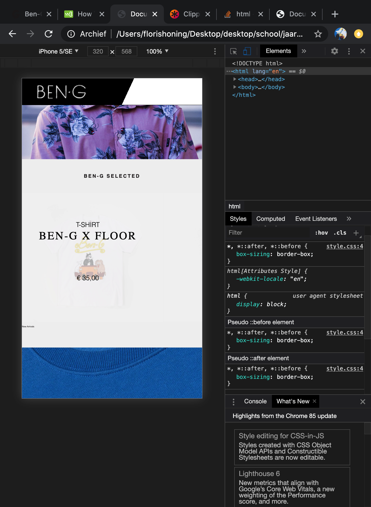

# Procesverslag
**Auteur:** Floris Honing
https://florishoning.github.io/BlokWeb/

Markdown cheat cheet: [Hulp bij het schrijven van Markdown](https://github.com/adam-p/markdown-here/wiki/Markdown-Cheatsheet). Nb. de standaardstructuur en de spartaanse opmaak zijn helemaal prima. Het gaat om de inhoud van je procesverslag. Besteedt de tijd voor pracht en praal aan je website.

## Bronnenlijst
1. -bron 1-
2. -bron 2-
3. -...-

## Eindgesprek (week 7/8)

-dit ging goed & dit was lastig-

**Screenshot(s):**

-screenshot(s) van je eindresultaat-

## Voortgang 3 (week 6)

### Stand van zaken

Ik heb voor deze keer het stukje boven de footer gemaakt. Dit maakt de eerste pagina nu zo goed als compleet. Bij het toevoegen van een email input web ik moeten werken met een nieuwe gradient. Deze is helemaal wit en heeft zwarte schuine dashes. [      ///] het is gelukt om dit te maken alleen moet ik het nu responsive zien te krijgen. Het moet namelijk in het midden blijven staan ipv naar de zijkant schuiven.

**Screenshot(s):**

### Agenda voor meeting
| Celine | Djescho | Floris |
|--------|:-------:|-------:|
| Responsiveness afbeeldingsgrootte | (Nog) geen vragen | Wat kan ik toevoegen om aan de surface plane te voldoen, want overal animaties bij maakt het niet beter |
| Zoekbalk 'pop-up' |  | Items in een gradient op hun plek laten bij responsive |
| Responsiveness van hamburger menu icoon naar menu-items naast elkaar uigelijnd in navigatiebalk |  |  |
| Timing tekst animaties (inschuiven vanaf de zijkant tijdens het scrollen) |  |  |
| First class is free section met meebewegende (achtergrond/overlay?) afbeelding |  |  |

### Verslag van meeting

In eerste instantie heb ik de lijntjes tussen social media links gemaakt doormiddel van een gradient. Echter bij responsive design werd deze meegetrokken naar de zijkant. Dit heb ik kunnen oplossen met hulp doormiddel van het maken van nieuwe divs die een border hebben aan de rechterkant. Door vervolgens de parent de content te laten centeren blijft alles goed in het midden staan.

## Voortgang 2 (week 5)

### Stand van zaken

De website gaat goed. Ik heb via internet een manier gevonden om afbeeldingen uit te snijden maar door dit te gebruiken moet ik werken met negatieve margin en andere rare dingen. Daarom vraag ik in het gesprek hoe dit beter kan.
Daarnaast ben ik begonnen aan de footer van de pagina.

**Screenshot(s):**

### Agenda voor meeting
| Celine | Djescho | Floris |
|--------|:-------:|-------:|
| Transitie in elkaar vouwen van header en main over de hero (header begint transparant en verkleurd bij het "vouwen") | Ik krijg de scroll knoppen maar niet werkende :) | Wat kan ik toevoegen om aan de surface plane te voldoen, want overal animaties bij maakt het niet beter |
| Timing tekst animaties (inschuiven vanaf de zijkant tijdens het scrollen) |  |  |
| Tekst op een makkelijke manier responsive uitlijnen |  |  |
| First class is free section met meebewegende (achtergrond?) afbeelding |  |  |
| Afbeelding correct uitknippen / plaatsen op basis van schermgrootte |  |  |

### Verslag van meeting

De meeting was handig, scrollsnap en een aantal andere dingen hebben de overflowing lijst mooier gemaakt. Ik wilde ook cut-outs maken van afbeeldingen binnen de pagina aan de hand van css. Dankzij Sanne is dit gelukt.

## Voortgang 1 (week 3)

### Stand van zaken

het opzetten van de website ging goed, ik ben begonnen met het toevoegen van genoeg content om de styling te kunnen doen. Een overflowing scrollbar toevoegen ging minder. Met hulp werkt deze nu met scrollsnap en flowd hij mooi buiten de pagina.

**Screenshot(s):**

### Agenda voor meeting

Dingen die we behandeld willen hebben:

- Responsive design (breakpoint) [Djescho]
- Scrollen met javascricpt [Djescho]
- Main en header vouwen inelkaar over de hero heen [Celine]
- Afbeeldingen in CSS [Floris en Djescho]
- wel goed doen [Djescho]
- Lege plek [Floris]

### Verslag van meeting

 Door mee te kijken en te helpen bij Djescho en Celine heb ik nog wat opgestoken over responsive design.

## Intake (week 1)

**Je startniveau:** -blauw-

**Je focus:** -surface plane-

**Je opdracht:** -Ben-g.nl-

**Screenshot(s):**

**Breakdown-schets(en):**

